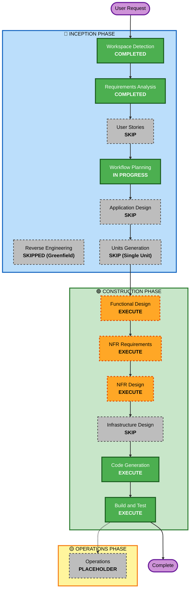

# Execution Plan

## Detailed Analysis Summary

### Transformation Scope
Greenfieldプロジェクト。既存システムは存在しないため、変換スコープ分析(ブラウンフィールド専用)は該当なし。単一のRust製CLIバイナリ(単一クレート)を新規に構築する。

### Change Impact Assessment
- **User-facing changes**: Yes — 新規CLIインターフェース(`run`/`validate`サブコマンド)を提供する
- **Structural changes**: Yes — 新規システムそのもの(Greenfield)
- **Data model changes**: Yes — YAML設定スキーマ(ジョブ定義)を新規設計する。永続データストアは持たない(ファイルシステムが対象兼記録媒体)
- **API changes**: N/A — Web API等の外部インターフェースは持たない
- **NFR impact**: Yes — パフォーマンス(大量ファイル走査)、セキュリティ(ファイル削除の安全性)、信頼性(冪等性・アトミック性)、クロスプラットフォーム対応(Linux/macOS/Windows)に影響する

### Risk Assessment
- **Risk Level**: Medium
  - 独立したCLIツールであり、他システムへの影響や共有インフラへの依存はない(その意味ではLow)
  - 一方でファイル削除という**不可逆な操作**を扱うため、誤削除・設定ミスによる実害のリスクは相応にある。セーフティブレーキ・dry-run・冪等性設計で緩和する方針
- **Rollback Complexity**: Easy(ツール自体のロールバックは容易。ただし削除済みファイルの復元はツールの範囲外)
- **Testing Complexity**: Moderate(OS差異のある分岐、日数境界値、安全機構の検証が必要)

## Workflow Visualization



### Text Alternative
```
Phase 1: INCEPTION
- Workspace Detection      : COMPLETED
- Reverse Engineering      : SKIPPED (Greenfield)
- Requirements Analysis    : COMPLETED
- User Stories             : SKIP
- Workflow Planning        : IN PROGRESS
- Application Design       : SKIP
- Units Generation         : SKIP (Single Unit)

Phase 2: CONSTRUCTION (Unit: neatnik-cli)
- Functional Design        : EXECUTE
- NFR Requirements         : EXECUTE
- NFR Design               : EXECUTE
- Infrastructure Design    : SKIP
- Code Generation          : EXECUTE (ALWAYS)
- Build and Test           : EXECUTE (ALWAYS)

Phase 3: OPERATIONS
- Operations               : PLACEHOLDER
```

## Phases to Execute

### 🔵 INCEPTION PHASE
- [x] Workspace Detection (COMPLETED)
- [x] Reverse Engineering (SKIPPED — Greenfield、既存コードなし)
- [x] Requirements Analysis (COMPLETED)
- [x] User Stories (SKIPPED)
  - **Rationale**: 単一の運用者(cronからツールを実行する管理者)を想定した自動化CLIであり、複数ユーザーペルソナや受け入れ基準による合意形成の必要性が薄い。要件確認質問(requirement-verification-questions.md)で機能・非機能要件を詳細に確定済みであり、User Storiesを追加しても新たな価値は限定的と判断。ユーザーにも2度選択肢を提示したが追加指示はなかった。
- [x] Execution Plan (IN PROGRESS → 本ドキュメント)
- [ ] Application Design - SKIP
  - **Rationale**: 単一クレート・単一バイナリの構成であり、複数サービス間のサービス層設計やコンポーネント境界の調整は不要。モジュール構成(config/scan/archive/relocate/delete/logging)はdraft-spec.md・requirements.mdで既に明確
- [ ] Units Generation - SKIP
  - **Rationale**: 並行開発が必要な複数ユニットへの分割は不要。パイプライン内の各モジュールは順序依存が強く、単一ユニット(`neatnik-cli`)としてConstruction Phaseを進める

### 🟢 CONSTRUCTION PHASE (Unit: `neatnik-cli`)
- [ ] Functional Design - EXECUTE
  - **Rationale**: 多段パイプラインの処理順序(等号設定時のカスケード処理含む)、設定バリデーションロジック、冪等性判定など詳細な業務ロジック設計が必要
- [ ] NFR Requirements - EXECUTE
  - **Rationale**: パフォーマンス、クロスプラットフォーム対応、Security Baseline(有効)・PBT(部分適用)の技術スタック選定が必要
- [ ] NFR Design - EXECUTE
  - **Rationale**: OSごとのロック/検出戦略、安全機構(セーフティブレーキ)、ロギング設計など、NFR要件を具体的な設計パターンに落とし込む必要がある
- [ ] Infrastructure Design - SKIP
  - **Rationale**: クラウドインフラやデプロイアーキテクチャを持たない(単一バイナリ配布+cron/systemd timer実行のみ)
- [ ] Code Generation - EXECUTE (ALWAYS)
  - **Rationale**: 実装計画とコード生成が必要
- [ ] Build and Test - EXECUTE (ALWAYS)
  - **Rationale**: ビルド・テスト・検証が必要

### 🟡 OPERATIONS PHASE
- [ ] Operations - PLACEHOLDER
  - **Rationale**: 将来のデプロイ・監視ワークフロー用のプレースホルダー

## Package Change Sequence
該当なし(単一クレートのGreenfieldプロジェクト)

## Estimated Timeline
- **Total Stages to Execute**: 7(Workspace Detection, Requirements Analysis, Workflow Planningは完了済み。残り: Functional Design, NFR Requirements, NFR Design, Code Generation, Build and Test)
- **Estimated Duration**: 明確な納期指定はないため未設定。各ステージ完了ごとにレビュー・承認を挟みながら進める

## Success Criteria
- **Primary Goal**: requirements.mdで確定した機能要件(3段階パイプライン、CLI、YAML設定)・非機能要件(安全性、冪等性、クロスプラットフォーム対応)を満たすRust製CLIツールを完成させる
- **Key Deliverables**: 動作するCLIバイナリ、設定サンプル(`config.example.yaml`)、テスト(example-based + PBT partial)、ビルド・テスト手順書
- **Quality Gates**: Security Baseline該当ルールの遵守、PBT-02/03/07/08/09の遵守、dry-run/セーフティブレーキ等の安全機構が期待通り動作すること
